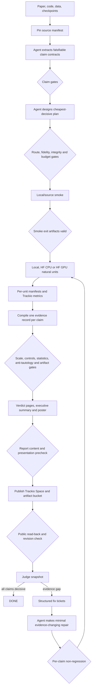

# ICML 2026 Agent Reproduction Harness

This repository separates a paper-neutral reproduction agent from paper-specific workspaces. The agent performs the judgment-heavy work—extracting claims, choosing evidence, designing experiments, and interpreting results—inside deterministic contracts, gates, restart manifests, and publication checks.

`verified` and `falsified` are equally decisive outcomes. The harness optimizes for honest, paper-faithful evidence, not confirmation.

## Challenge results

The reproduction campaign reached sixth place on the board. These results describe the judged logbooks produced by the agent; the deterministic harness below codifies the methodological and operational lessons from that campaign.

| Metric | Result |
|---|---:|
| Leaderboard rank | **6th** |
| Logbooks judged by the board | **253** |
| Total score | **2,560** |
| Maximum possible score | **2,866** |
| Success percentage | **89.32%** |
| Logbooks at full credit | **168 / 253** |
| Full-credit percentage | **66.40%** |
| Remaining gap to the judged maximum | **306 points** |

The important signal is not only the aggregate score: two thirds of judged logbooks resolved every selected claim at full credit, across theoretical, empirical, artifact-audit, model-evaluation, and falsification routes.

## What makes this architecture stand out

- **It predicts gradeability before it spends.** Before paid compute, the claim and plan gates ask whether every claim has a source anchor, decisive verification and falsification conditions, the right evidence modality, adequate fidelity and scale, controls, statistics, a smoke unit, expected artifacts, and an explicit budget. The prediction is not “the claim will verify”; it is “this experiment can produce full-credit evidence in either direction.”
- **It is deterministic about evidence, not scientific judgment.** Schemas, hashes, route discovery, run recording, artifact validation, stage derivation, report checks, publication receipts, and verdict ingestion are deterministic. The agent spends its reasoning on reading the paper, classifying claims, designing experiments, interpreting evidence, and writing honest verdicts.
- **It treats truth symmetrically.** `verified` and `falsified` are both decisive. Counterexample search is part of every claim contract, and clean falsification stops needless escalation instead of being treated as a failed reproduction.
- **It makes scientific adequacy executable.** Fidelity, paper scale, dataset and checkpoint provenance, row identity, leakage prevention, baselines, destructive controls, uncertainty, and theorem non-vacuity are machine gates rather than optional prose at the end.
- **It cannot stay green on stale evidence.** Every stage is tied to canonical upstream hashes. Editing a claim, plan, run artifact, evidence file, page, or poster invalidates dependent stages and rewinds the derived state automatically.
- **It is restart-safe at the experimental unit.** A seed, fold, dataset, model, scenario, or claim is recorded independently with expected artifact hashes. A stopped sweep loses only unfinished units, and aggregates can be rebuilt from completed records.
- **It closes the judge loop with evidence-changing repairs.** Judge verdicts are tied to an exact public revision, stale responses are rejected, repair attempts are bounded, unchanged evidence cannot be reported again, and previously decisive claims are protected by per-claim non-regression.
- **It verifies the public submission, not just the local workspace.** Publication is incomplete until the static logbook is fetched back, required content is found, local placeholders are absent, the public content is hashed, and the receipt matches the intended Space and revision.
- **It scales to new papers without core drift.** Paper routes, launchers, model ladders, and dependencies are local to each workspace. The core contains evidence vocabulary and invariants—not paper names or one-off scientific logic.
- **It is auditable end to end.** Atomic manifests, append-only events, exact commands, Trackio runs, job identifiers, artifact hashes, public revisions, judge snapshots, and fix tickets preserve how each verdict was reached.

## Key features

| Feature | Architectural guarantee |
|---|---|
| Claim-typed evidence router | Artifact, theorem, magnitude, ranking, mechanism, quality, and provenance claims begin with different evidence routes. |
| Cheapest-decisive gate cascade | `source → claims → plan → budget → smoke → execution → evidence → report → public read-back`; expensive work cannot skip cheaper validity checks. |
| Content-addressed stage machine | State is derived from valid schemas and current hashes rather than an editable or existence-only stage flag. |
| Scientific-method gates | Scale, fidelity, data integrity, controls, statistics, counterexamples, and anti-tautology are enforced per claim. |
| Natural-unit checkpointing | Each seed/fold/model/dataset/scenario produces an independently valid run manifest and artifact set. |
| Paper-local route plugins | New papers add `claim_routes.json` and scripts inside their workspace without modifying the agent core. |
| Budget-gated execution | Plans declare expected and maximum spend, order units by cost tier, and require a smoke run before paid or scaled work. |
| Verdict-first evidence compiler | Exactly one scoped, metric-bearing evidence record is required per claim before report generation. |
| Public-content receipt | Remote read-back produces a content hash tied to the publication receipt and exact public revision. |
| Bounded non-regressing repair | Stale judge responses, unchanged repairs, exceeded attempts, and regressions of decisive claims are rejected. |
| Trackio observability spine | Commands, output, metrics, alerts, artifacts, dashboards, pages, and publication remain inspectable from the logbook. |
| Machine-readable CLI contract | Exit codes and JSON status make validation and orchestration composable without moving scientific reasoning into scripts. |

## Repository layout

```text
icml-2026-agent-repro/
├── agent_harness/       # contracts, gates, content hashes, state derivation, CLI
├── configs/             # paper-neutral route types and a paper-local config template
├── schemas/             # JSON schemas for sources, claims, plans, runs, and evidence
├── templates/           # editable contract templates
├── scripts/             # generic scaffold, router, logbook writer, smoke/read-back tools
├── prompts/             # scientific reproduction policy used by the agent
├── posterly/            # poster rendering and visual preflight
├── tests/               # core harness and repository-layout regression tests
└── paper_workspaces/
    └── repro_<paper>_workspace/
        ├── .repro/      # source, claim, plan, run, evidence, report, publish, judge state
        ├── claim_routes.json
        ├── scripts/
        ├── outputs/
        └── .trackio/logbook/
```

All paper code, routes, model ladders, data, outputs, and launchers belong under `paper_workspaces/`. Core configuration contains no named papers.

## Architecture

### Two layers, one content-addressed handshake

```text
┌──────────────────────────────────────────────────────────────────────────┐
│  SCIENTIFIC AGENT LAYER  (reasoning)                                    │
│  read paper · extract claims · choose evidence modality · design tests  │
│  inspect failures · interpret results · write scoped verdicts and prose │
└────────────────▲────────────────────────────────┬────────────────────────┘
     next action  │                                │ writes/repairs
  from disk state │                                ▼ contract or evidence
┌─────────────────┴────────────────────────────────────────────────────────┐
│  EVIDENCE CONTROL PLANE  (deterministic — agent_harness/ + scripts/)    │
│  scaffold · validate · hash · route · record-run · derive-state         │
│  compile · precheck · record-report · public-verify · ingest-judge       │
│  gates: source · modality · fidelity · integrity · budget · smoke       │
│         execution · controls · statistics · report · public revision    │
└──────────┬──────────────────────┬───────────────────────┬────────────────┘
           │                      │                       │
           ▼                      ▼                       ▼
 paper_workspaces/<paper>/   Local / HF Jobs       .repro/events.jsonl
 .repro/*.json               CPU · GPU · matrix     atomic manifests
 scripts + outputs                  │                content hashes
 .trackio/logbook                   ▼
           │                 Trackio metrics
           │                 Hub artifact bucket
           └───────────────────────▶ HF Space / public static logbook
                                            │
                                            ▼
                                      Board verdict
                                            │ exact public revision
                                            ▼
                                  judge snapshot + fix tickets
                                            │ bounded, non-regressing,
                                            │ evidence must change
                                            └──────────────────────▶ agent
```

The handshake is deliberately narrow. `repro-agent status` derives the next action from disk. The agent writes or repairs the requested scientific artifact; deterministic validation either accepts it and exposes the next action or reports the exact failed gate. Neither layer impersonates the other.

### End-to-end evidence machine



The control plane owns handoffs and validity. It does not decide scientific truth. The agent still classifies claims, chooses appropriate evidence, designs controls, and renders the final verdict.

### The stage machine

Stage is re-derived from valid files on disk. It is not stored as an editable stage counter. Every downstream artifact records hashes of its upstream inputs; changing a claim, plan, result, page, or poster automatically rewinds the derived stage.

| Derived stage | Required valid exit artifact | Next action |
|---|---|---|
| `new` | none | Pin paper/code/data sources. |
| `source_pinned` | `.repro/source_manifest.json` | Complete claim contracts. |
| `claims_locked` | `.repro/claims.json` and passing claim gates | Build the execution plan. |
| `plan_gated` | `.repro/plan.json` and passing plan gates | Run the smoke unit. |
| `smoke_green` | Current successful smoke manifest and hashed artifacts | Run planned evidence units. |
| `running` | Current non-smoke unit manifests | Compile evidence. |
| `evidence_compiled` | `.repro/evidence.json` with unresolved gates | Repair evidence gaps. |
| `evidence_complete` | Every claim decisive and all evidence gates passing | Render the report. |
| `report_green` | Current `report_manifest.json` | Publish and verify remotely. |
| `published_verified` | Current `publish_receipt.json` with successful public read-back | Ingest judge verdict. |
| `repair_required` | Current judge snapshot with sub-decisive claims | Execute fix tickets without regression. |
| `done` | Every current judged claim is `verified` or `falsified` | None. |

## Methodology contracts

The generic claim contract in [schemas/claims.schema.json](schemas/claims.schema.json) requires:

- Exact claim text and paper/source anchor.
- Evidence modality and exact metric/denominator/comparator.
- Symmetric verification and falsification conditions.
- Paper scale and the minimum defensible adequate scale.
- Real algorithm, architecture/checkpoint, and metric fidelity.
- Dataset/checkpoint revisions, row identity, split policy, preprocessing parity, and leakage prevention.
- Baseline, null/negative/destructive controls, paired randomness, and all-cell requirements.
- Seeds, replicates, uncertainty, and multiple-comparison policy.
- Counterexample or adversarial-region search.
- Independent computation and non-vacuity checks for theoretical claims.

Evidence routing is claim-dependent:

| Claim type | First evidence route |
|---|---|
| Artifact, table, identity, or provenance | Recompute exact rows, joins, counts, denominators, and revisions. |
| Theorem, rate, or bound | Audit assumptions and proof obligations; add independent algebra/numerics, non-vacuity, boundary cases, and counterexample search. |
| Empirical magnitude | Use the real model/data/metric at paper scale or a predeclared adequate scale. |
| Ranking | Run same-condition, head-to-head comparisons for every required cell. |
| Mechanism or causal claim | Use interventions plus null, no-intervention, negative, or destructive controls. |
| Human/LLM quality claim | Reproduce the evaluation protocol, sampling unit, rubric, model/revision, uncertainty, and relevant baselines. |

Run cheap source and artifact checks before training. A clean falsification should stop unnecessary escalation when it already resolves the literal claim.

## Workflow

### 1. Scaffold a paper-local workspace

```bash
uv run python scripts/scaffold_repro_paper.py \
  --title "Paper title" \
  --slug paper_slug
```

This creates `paper_workspaces/repro_paper_slug_workspace`, a verifier skeleton, paper-local `claim_routes.json`, and contract templates. It never modifies core routes.

### 2. Pin sources and initialize state

```bash
uv run repro-agent init \
  --workspace repro_paper_slug_workspace \
  --paper-id openreview-or-stable-id \
  --title "Paper title" \
  --source paper.pdf \
  --source-kind paper \
  --revision v1
```

Add official code, datasets, checkpoints, and exact revisions to `.repro/source_manifest.json`. For local files, include SHA-256 so the source-content gate can detect mutation.

Canonical JSON hashes used by downstream contracts can be computed with:

```bash
uv run repro-agent hash --json paper_workspaces/repro_paper_slug_workspace/.repro/source_manifest.json
```

### 3. Lock claims and plan

Fill `.repro/claims.json`, then run:

```bash
uv run repro-agent precheck --workspace repro_paper_slug_workspace --stage claims
```

Fill `.repro/plan.json` in non-decreasing `cost_tier` order. Every plan must map all claims, include a smoke unit, and define expected artifacts for each restart unit.

```bash
uv run repro-agent precheck --workspace repro_paper_slug_workspace --stage plan
uv run repro-agent status --workspace repro_paper_slug_workspace
```

### 4. Route and execute through Trackio

List every paper-local route:

```bash
uv run python scripts/run_claim_route.py --list
```

Dry-run first. Add `--execute` only after the plan gate is green:

```bash
uv run python scripts/run_claim_route.py --paper paper_slug --claim all
```

Run experiment commands from the paper workspace through Trackio so the exact command, code, output, duration, and artifacts enter the logbook:

```bash
cd paper_workspaces/repro_paper_slug_workspace
trackio logbook run -- ../../.venv/bin/python ../../scripts/run_claim_route.py \
  --paper paper_slug --claim all --execute
```

Long work must be split by a natural unit such as seed, model, dataset, fold, target size, scenario, or claim. Persist each unit before launching the next one.

Record a completed unit and its artifacts:

```bash
uv run repro-agent record-run \
  --workspace repro_paper_slug_workspace \
  --unit-id smoke-local \
  --kind smoke \
  --status success \
  --command "python scripts/verify_claims.py --smoke" \
  --artifact outputs/smoke.json
```

Changing a recorded artifact invalidates that unit until it is rerun and re-recorded.

### 5. Compile and gate evidence

Compile raw unit outputs into `.repro/evidence.json`, with exactly one record per claim. Every decisive record must name its metric and scope, link hashed raw artifacts, and show that fidelity, data-integrity, controls, and statistics checks passed.

```bash
uv run repro-agent precheck --workspace repro_paper_slug_workspace --stage evidence
```

`toy` and `inconclusive` remain honest evidence states, but they do not pass the decisive-evidence gate.

### 6. Write the logbook and report

Use [scripts/write_verdict_logbook.py](scripts/write_verdict_logbook.py) to normalize verifier JSON into verdict-first claim pages. Each page must lead with:

- `VERIFIED`, `FALSIFIED`, `TOY`, or `INCONCLUSIVE`.
- Exact metric and comparison.
- Model, data, scale, seed/replicate count, and limitations.
- Command, job ID, raw artifacts, and relevant controls.

Add and pin the executive summary first, then render and pin the Posterly poster. Record a content-addressed report only after the evidence gate passes:

```bash
uv run repro-agent record-report \
  --workspace repro_paper_slug_workspace \
  --artifact .trackio/logbook/pages/conclusion/page.md \
  --artifact poster.html
```

### 7. Publish and verify the public result

```bash
cd paper_workspaces/repro_paper_slug_workspace
trackio logbook publish owner/descriptive-space-name
```

Run the public read-back validator. Confirm that the published content contains the current verdicts, metrics, job IDs, poster and artifact URLs, and that it contains no local paths or placeholders. Save its content-hashed receipt:

```bash
uv run python scripts/validate_published_logbook.py \
  --space owner/descriptive-space-name \
  --must-contain "claim-1" \
  --report-json paper_workspaces/repro_paper_slug_workspace/.repro/public_validation.json
```

Only after successful read-back record the publication:

```bash
uv run repro-agent record-publish \
  --workspace repro_paper_slug_workspace \
  --url https://huggingface.co/spaces/owner/space \
  --public-revision COMMIT_SHA \
  --validation-report paper_workspaces/repro_paper_slug_workspace/.repro/public_validation.json
```

### 8. Close the judge-feedback loop

Normalize the judge response to a JSON object containing the exact `public_revision` from the publication receipt and a `claims` array with `id`, `verdict`, and `feedback`, then run:

```bash
uv run repro-agent ingest-judge \
  --workspace repro_paper_slug_workspace \
  --file judge-response.json
```

This rejects stale verdicts, then writes a snapshot and bounded structured tickets for claims that are not yet decisive. Tickets request decisive evidence—verification or falsification—and must result in an evidence-changing experiment. Unchanged content cannot pass report recording and must not be republished.

Ingesting a later verdict also enforces per-claim non-regression: a claim previously judged decisive cannot silently become toy or inconclusive even if the aggregate score rises.

## Main code and functions

| File | Main functions | Responsibility |
|---|---|---|
| `agent_harness/contracts.py` | `validate_source`, `validate_claims`, `validate_plan`, `validate_run`, `validate_evidence` | Machine contracts and allowed evidence/verdict vocabulary. |
| `agent_harness/gates.py` | `claim_gates`, `plan_gates`, `evidence_gates`, `blocking_failures` | Scientific-method and deterministic handoff gates. |
| `agent_harness/state.py` | `derive_state` | Content-addressed stage derivation and automatic stale-artifact rewind. |
| `agent_harness/gates.py` | `fresh_successful_units` | Validates complete plan execution from current per-unit manifests and artifact hashes. |
| `agent_harness/io.py` | `hash_json`, `hash_file`, `hash_paths`, `atomic_write_json`, `append_jsonl` | Canonical hashes, atomic manifests, and append-only events. |
| `agent_harness/workspaces.py` | `discover_workspaces`, `resolve_workspace` | Paper workspace discovery under `paper_workspaces/`. |
| `agent_harness/cli.py` | `cmd_precheck`, `cmd_status`, `cmd_record_run`, `cmd_record_report`, `cmd_record_publish`, `cmd_ingest_judge` | User-facing deterministic workflow commands. |
| `scripts/scaffold_repro_paper.py` | `verifier_source`, `route_snippet`, `main` | Creates paper-neutral verifier and paper-local route/contract templates. |
| `scripts/run_claim_route.py` | `discover_configs`, `load_configs`, `run_matrix_hf_job`, `main` | Discovers paper-local routes and dry-runs or executes local/HF jobs. |
| `scripts/open_logbook.py` | `main` | Creates the Trackio logbook and challenge metadata. |
| `scripts/write_verdict_logbook.py` | `normalize_claims`, `write_claim_page`, `write_summary_page` | Renders verdict-first logbook pages from evidence output. |
| `scripts/validate_published_logbook.py` | `main` | Fetches and validates public Space content after publication. |
| `scripts/smoke_test.py` | module entry | Checks the shared Python/Hugging Face environment. |

## Core invariants

- Core code and config never contain paper identities or paper-specific logic.
- Paper-local commands are dry-run unless execution is explicitly requested.
- Paid/scaled work cannot precede source, claim, plan, and smoke gates.
- A file's existence is never sufficient; schema, upstream hashes, expected artifacts, and content hashes must agree.
- Every claim has both a verification and falsification route.
- Theory checks must not compare a formula to itself.
- Empirical checks must account for data provenance, leakage, fidelity, scale, controls, and statistical adequacy.
- Failed gates and missing judge output are failures, not successful no-ops.
- Publication is incomplete until public content is read back and tied to an exact revision.
- Feedback triggers repair work, never unchanged republishing.
- Repair is bounded by per-claim non-regression.

## Validation

Run the harness tests with an isolated pytest environment:

```bash
uv run --with pytest==8.3.5 python -m pytest -q tests
```

Run the shared environment smoke test with:

```bash
uv run python scripts/smoke_test.py
```
